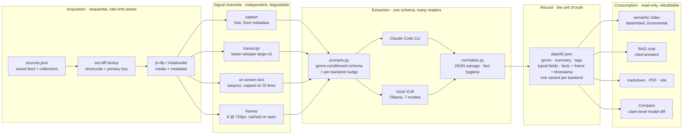

# reels-scrap

**Turn your saved Instagram reels into a searchable, cited research archive — on your
own machine.** Reels come in; typed records, PDFs, a docs site, semantic search and a
RAG chat come out. Vision runs on your Claude subscription *or* on your own GPU for $0.


```
sync ──► ingest ──► extract ──────► structure ──► render ──► index
poll     download   transcript      genre +       markdown   semantic
sources  + metadata on-screen text  typed fields  PDF        search
(dedup)             vision          facts with    docs site  + RAG chat
                                    provenance
```

**New here? Three pages in order:** [docs/SETUP.md](docs/SETUP.md) →
[docs/INSTAGRAM-ACCESS.md](docs/INSTAGRAM-ACCESS.md) → [docs/SYNC.md](docs/SYNC.md).
Everything else is indexed in **[docs/README.md](docs/README.md)**.

## What makes a record worth keeping

| | What you get | Why it matters |
|---|---|---|
| **Typed, not prose** | A product reel yields `{name, price, link, claims}`; a tutorial yields `{tools, commands, links, steps}` | You can filter, diff and export it. A paragraph you can only re-read. |
| **Provenance per fact** | Every fact carries the **frame + timestamp** it came from | Scrub to that second and check it. Wrong claims are findable, not buried. |
| **Model provenance** | `tokens.model` records the model that actually **ran**, not the one config asked for | Config said `sonnet-4-6` while the CLI ran `claude-opus-5` — measured, not assumed |
| **Two models, one reel** | Each backend's answer is stored as a named `variant`, never overwriting another | Compare Claude against a local 7B on *your* reels before choosing |
| **Nothing implicit** | No model auto-downloads, no source auto-added, no re-extraction behind your back | Every expensive thing is a command you typed |

## The approach, for someone who wants to dissect it

### Abstract

A saved reel is a dense multimodal artifact — speech, on-screen text, a caption, and
the visual scene — with **no retrievable structure**. Saving one costs a tap; finding it
again costs everything, so a saved collection decays into a write-only archive. This
project treats that as an *information-extraction* problem rather than a storage
problem: reduce each video to a typed, grounded record, then make the corpus queryable.

Formally, each reel `V` is reduced to a record

```
R(V) = ⟨ g, s, T, F_g, {(claim_i, frame_i, t_i)} ⟩
```

where `g` is a genre drawn from a closed set, `s` a summary, `T` tags, `F_g` a
**genre-conditioned** field schema (a product reel has `{name, price, link, claims}`; a
tutorial has `{tools, commands, links, steps}`), and each extracted claim carries the
frame index and timestamp it came from. The provenance term is the load-bearing part:
it converts an unverifiable summary into a checkable one, because every claim points at
the second of video that is supposed to support it.

Extraction runs on interchangeable backends — a frontier model via the Claude Code CLI,
or one of seven open-weights VLMs on a local GPU — and **each backend's answer is stored
as a named variant on the same reel**, never overwriting another. That single decision
turns "which model should read my reels?" from an opinion into a measurement on the
user's own corpus.

### The problem, stated precisely

| Sub-problem | Why it is hard here |
|---|---|
| **Acquisition** | Saved collections are private and have no official API. Instagram rate-limits hard, retired the per-collection endpoint mid-project (2026-08-17), and a logged-in session is the whole account — so acquisition is a *security* problem as much as a scraping one |
| **Signal fusion** | The content is split across four channels (caption, speech, on-screen text, visual scene) that disagree, overlap, and are individually incomplete |
| **Grounding** | A summary that invents a plausible detail is worse than no summary, because it is unfalsifiable at the point of use |
| **Heterogeneity** | A workout reel, a product ad and a tutorial have nothing in common structurally; one flat schema fits none of them |
| **Retrieval** | Dense retrieval over ~750 short records is weak on exactly the tokens that matter — a URL, an `@handle`, a product name |
| **Evaluation** | There is no ground truth. Nobody is going to hand-label 750 reels, so model quality has to be argued from agreement, coverage and inspection instead of accuracy |

### Method



Four commitments hold the design together:

1. **The record is the unit of truth, not the artifact.** `data/<id>.json` is written
   once and enriched in place; markdown, PDFs, the site, the index and the knowledge
   base are all *derived* and disposable. Wiping `output/` costs a rebuild, never a
   re-download — which is what makes experimentation affordable.
2. **Every stage is idempotent and resumable.** Sync is a set-diff against the pool, so
   re-running is free; a failure lands in a dead-letter with a reason rather than
   halting the run.
3. **Measurement before belief.** Nothing about extraction quality is asserted from
   reading code. The A/B harness re-runs reels on *identical cached frames* so the model
   or the prompt is the only variable, and reports metrics **split by marker kind** —
   because the aggregate lied once already (see below).
4. **Guards stop, they do not warn.** A run that cannot succeed is ended before it
   spends a request or an hour of GPU: `gpu_blockers()` (exit 3), `auth_blockers()`
   (exit 4). Both exist because the failure they catch was paid for in full, once.

### The stack, and what each piece is doing there

| Layer | Tool | Why this one |
|---|---|---|
| Acquisition | [yt-dlp](https://github.com/yt-dlp/yt-dlp), [instaloader](https://instaloader.github.io/) | yt-dlp carries the cookie handling and format selection; instaloader covers the session path. Neither is parallelised — Instagram punishes that |
| Speech | [faster-whisper](https://github.com/SYSTRAN/faster-whisper) (large-v3) | CTranslate2, **not** torch — the transcript stage stays installable on a machine with no CUDA. ~6.5× realtime batched; 454 transcribed / 123 genuinely silent across the corpus |
| On-screen text | [easyocr](https://github.com/JaidedAI/EasyOCR) | Optional (pulls torch). Feeding it back into the prompt is capped at 15 lines — 40 lines *cost* 1.5 facts/reel, measured |
| Vision, cloud | [Claude Code CLI](https://docs.claude.com/en/docs/claude-code) | Uses the existing subscription, so no API key sits on disk. Prompt goes on **stdin**, never argv — a large analysis silently degraded to "unavailable" (WinError 206) until that was fixed |
| Vision, local | [Ollama](https://ollama.com) + [Qwen2.5-VL 7B q8](https://huggingface.co/Qwen/Qwen2.5-VL-7B-Instruct) and 6 others | Rebuilt at **32k context** because the stock 4096 rejects six frames outright. $0 per reel, no egress |
| Retrieval | [fastembed](https://github.com/qdrant/fastembed) (ONNX) | Local, no GPU needed. The index is keyed on a **content hash**, not mtime, so writing a variant does not trigger a full re-embed — 4m14s once, then 1.0s |
| API | [FastAPI](https://fastapi.tiangolo.com/) + Pydantic | The schemas *are* the wire contract, shared by the typed client in `web/`. Binds `127.0.0.1`, no auth, by design |
| UI | Vite + React + shadcn-style, Catppuccin Mocha | Client-side filtering over one corpus load; 13 tabs, no server round-trip per filter |
| Rendering | [weasyprint](https://weasyprint.org/), [mkdocs-material](https://squidfunk.github.io/mkdocs-material/) | Both best-effort: a missing binary degrades one output, never the run |
| CLI | [Typer](https://typer.tiangolo.com/) | Command name derives from the function name, so a command can move file without changing its interface |

### Design decisions, and what each one costs

| Decision | Bought | Paid |
|---|---|---|
| Flat JSON records on disk, no database | Zero setup, greppable, trivially diffable, rebuild anything | No transactions, no query planner; whole-corpus operations are O(n) file reads |
| Reel shortcode as the primary key | Dedup is a set-diff; the same reel in two collections is downloaded once | Collections become *membership manifests*, so a collection is only as visible as the saved-feed scan (`COLLECTION_SCAN = 1000`) |
| Model output stored as **variants** | Two readers coexist on one reel; the Compare tab diffs them at claim level for $0 | Records grow; a stale variant can be mistaken for a current one without reading `tokens.model` |
| Genre-conditioned schema | Fields that actually fit the content, and are filterable | The genre classifier becomes load-bearing — a misclassification costs the whole field set |
| Sequential ingest, concurrent extraction | Survives Instagram's rate limits while still using the machine | Wall-clock is bounded by acquisition on a first run |
| Local vision as a first-class backend | $0/reel, zero egress, no key on disk | A 7B misses ~1.0–2.2 facts/reel against the Claude arm and will occasionally invent a name |
| Guards that exit non-zero | A dead session costs 1 request instead of 20; a busy GPU costs 1 second instead of 40 minutes | A false positive blocks a run that would have worked — hence `REELS_IGNORE_AUTH` / `REELS_IGNORE_GPU` |

### Threats to validity — the parts a reviewer should attack first

Stated here rather than buried, because they bound every number in this repo:

- **The reference arm is itself a model.** Agreement is measured against the Claude
  output, not against truth. A claim marked "local-only" may be correct and merely
  absent from the reference.
- **The aggregate lied once.** A prompt change appeared to lift marker recall
  0.169 → 0.453; splitting by kind showed most of the movement was a model copying a
  40-hashtag block, while *sponsorship* detection had gone **backwards** (2/17 → 1/17)
  before v2 fixed it (15/17). The harness now reports `by_kind` for this reason.
- **Sample sizes are small and stated.** 30 reels for the bench, 3–12 for ablations.
  Nothing here is a population claim.
- **Claim matching uses containment, not Jaccard** — Jaccard scored a correct match at
  0.3 because one model writes prose where another writes shouted fragments. The metric
  is a design choice with its own bias.
- **The corpus predates its own prompts.** 719 of 755 records were extracted before the
  current prompt, so their `structured.links` is empty for reasons unrelated to model
  ability. Re-extracting is an open decision, not an oversight.
- **Only the local arm was re-measured** under the v2 prompt. The Claude arm's numbers
  are from before it.

Full method, results and the written why-they-differ analysis:
[`docs/research/`](docs/research/README.md).

## Quickstart

### Windows (this machine)

```powershell
.\scripts\setup-windows.ps1        # venv + deps + web build + git hooks + local model + tests
```

Then every command in this repo takes the same shape:

```powershell
$env:PYTHONUTF8=1
.venv-win\Scripts\python.exe -m reels_scrap.cli <command>
```

> **Why `.venv-win` and `PYTHONUTF8`:** `.venv` is a Linux venv left from the old box,
> and Windows defaults file reads to cp1252 — which cannot read this project's own
> JSON back once a caption contains an emoji.

### Linux / macOS

```bash
python3.12 -m venv .venv && . .venv/bin/activate
pip install -e ".[cpu]"                  # torch-free: transcript + vision + pdf + docs
git config core.hooksPath .githooks      # blocks credentials from ever being committed
pytest -q
reels-scrap --help                       # the console script, same commands
```

`pip install -e .` alone is deliberately lean (15 deps, no torch). Heavy features are
opt-in extras — see the [extras table](docs/SYNC.md#environments--two-track-gated-by-extras).

## 1. Give it your Instagram session

Nothing private — your saved reels, your collections — is readable without a logged-in
session. **No password is ever typed into this tool.** There are four ways to hand it a
session, and they are not equally safe:

| Approach | Works on | Secret lands in | Use when |
|---|---|---|---|
| **Exported `cookies.txt`** | everywhere | a gitignored file in the repo root | **Windows — the only path that works** |
| **Browser cookie extraction** | Linux/macOS | memory only, read live from the browser | you are on Linux and want no secret on disk |
| **instaloader session** (`login`) | everywhere | `~/.config/instaloader`, outside the repo | you want the secret out of the project directory |
| **No auth at all** | everywhere | nothing | public reels by URL — the default |

Windows cannot read Chrome's cookies: Chrome 127+ encrypts them app-bound and yt-dlp
cannot decrypt them ([yt-dlp #10927](https://github.com/yt-dlp/yt-dlp/issues/10927)).
Closing Chrome does not help. Export instead, and run with `--browser cookies.txt`.

> ⚠️ **`cookies.txt` is a live login, not a config file.** Anyone holding it is signed
> into your Instagram until you log out. It is gitignored, blocked by the pre-commit
> hook, and must never be pasted into a chat, an issue, a screenshot or a log.
> **Rotate it by logging out of Instagram** — that invalidates every copy at once.

Full comparison, the export steps, the threat model and what to do when it expires:
**[docs/INSTAGRAM-ACCESS.md](docs/INSTAGRAM-ACCESS.md)**.

## 2. Tell it what to read

```bash
reels-scrap add-source "https://www.instagram.com/<you>/saved/<name>/<id>/"
reels-scrap list-sources
```

A reel saved **without** picking a collection lands only in the default "All Posts"
feed. Register that too, or those reels stay invisible:

```json
{"name": "saved-all", "url": "https://www.instagram.com/<you>/saved/all-posts/",
 "type": "saved", "enabled": true, "limit": 200}
```

`sources.json` names your private collections, so it is **gitignored** —
`sources.example.json` is the version-controlled template.

## 3. Sync

`sync` is the entry point you use forever after. It polls every enabled source, diffs
against what is already on disk, and ingests **only the new reels**.

```bash
# free, local GPU vision, no egress  (~5-10 s/reel)
PYTHONUTF8=1 .venv-win/Scripts/python.exe -m reels_scrap.cli sync -c config-local.yaml

# richer records via your Claude subscription  (~26 s/reel, ~$0.37/reel)
PYTHONUTF8=1 .venv-win/Scripts/python.exe -m reels_scrap.cli sync -c config.yaml --browser cookies.txt

# one source only
... sync -c config-local.yaml --only saved-all

# re-attempt whatever dead-lettered last run
... sync -c config-local.yaml --retry-failed
```

**It is idempotent and incremental.** Re-run it any time: nothing already downloaded is
fetched again, no duplicate record is ever created, and anything that fails goes to a
dead-letter with a reason instead of stopping the run.

Two guards run *before* it spends a single Instagram request — a busy GPU and a dead
cookie both cost far more when discovered halfway through, and each **stops** the run
rather than warning. Exit codes are load-bearing: **4** = the session is unusable,
**3** = GPU busy or contended, **2** = invalid flag, **1** = nothing to do.
`REELS_IGNORE_AUTH=1` and `REELS_IGNORE_GPU=1` override the respective guard.

### The repair pass you will eventually need

A reel whose *vision* failed is already downloaded, so `sync` never counts it as new
again and `--retry-failed` only re-attempts **ingest**. Such a reel stays summary-less
forever until something looks for it:

```bash
... -m reels_scrap.cli extract-cmd -c config-local.yaml --missing-vision
```

## Which model reads your reels

Both backends produce the **same schema** — genre, summary, tags, typed `structured`
fields, facts with frame provenance, token counts. They differ in depth, speed, price
and where your frames go.

| | Claude Code (`claude-cli`) | Local GPU (`local`) |
|---|---|---|
| Runs on | your Claude subscription, no API key | Ollama on your own card |
| Frames leave the machine | **yes** — to Anthropic | **no** — strict local, `vision_local_fallback: false` |
| Cost | ~$0.34–0.37 / reel | **$0** |
| Speed | ~26–30 s / reel | 5–11 s / reel |
| Facts / reel | **7.4** | 5.2–6.4 |
| Summary length | **833 chars** | 293–419 chars |
| Typed fields filled | **4.0** | 1.8–3.4 |
| Failure mode | occasional exit-0 with empty stdout | invents a name the reference leaves out |

*Measured on this corpus: a 30-reel stratified sample on identical cached frames
([BENCH-2026-08-06](docs/research/BENCH-2026-08-06.md)) plus 49 live reels
(see [STATUS.md](STATUS.md)). Claim agreement between the two arms is 0.104 — they are
not interchangeable, they are different readers.*

**How to choose, rather than guess:** run both. Records store one variant per backend,
so the *Compare* tab shows the claim-level difference on **your** reels — which claims
only Claude found, which only the local model found, at what cost. That is what the
`variants` design is for.

Eight models are supported, seven of them open-weights on your own GPU:

```bash
reels-scrap models list                      # installed vs available
reels-scrap models pull qwen3vl-8b           # explicit pull, rebuilt at 32k context
reels-scrap bench sample -n 30 --seed 0      # one fixed, genre-stratified sample
reels-scrap bench run --profile qwen3vl-8b   # resumable, one model resident at a time
reels-scrap bench report                     # metrics + a written why-they-differ pass
```

The bench **produces evidence, it does not decide**. Changing the production default is
a separate, deliberate change. What each model is and how it reads a reel:
[docs/research/MODELS.md](docs/research/MODELS.md).

### The GPU is shared — this is the trap that costs an hour

Never start a local-vision run onto a busy card. Ollama silently offloads layers to CPU
and then **every** reel dies on the 240 s read timeout — one measured run burned 40
minutes to produce 5 reels and 3 dead letters. Two guards exist because of it:

1. **Before the run** — `gpu_blockers()` refuses to start when a foreign model is
   resident, free VRAM is under the model's `vram_gb` + 2 GB, or utilisation is ≥ 50 %.
2. **During the run** — a failed call re-reads `ollama ps`; anything but `100% GPU`
   raises `GpuContended` and ends the run rather than retrying. A start-of-run check
   cannot see a job that starts *later*, which is exactly what happened once.

`REELS_IGNORE_GPU=1` overrides both. Check with `ollama ps` and `nvidia-smi` — and do
not stop someone else's model to make room.

## What you get

| Path | What |
|---|---|
| `data/<id>.json` | **the record of truth** — every other artifact is rebuildable from it |
| `output/markdown/<id>.md` | genre, typed fields, provenance table |
| `output/pdfs/<id>.pdf` | per-reel PDF |
| `output/site/index.html` | mkdocs-material site, master index to every reel |
| `output/collections/<slug>.html` | self-contained per-collection document |
| `output/index/search_index.*` | local semantic index (incremental — 0.55 s, not a 4 min rebuild) |
| `output/knowledge/*.json` | the corpus aggregated into topics |
| `output/logs/run.log`, `run_report.json` | per-reel, per-stage success/error |

`data/` (expensive, irreplaceable) and `output/` (cheap, regenerable) are separate on
purpose: wipe `output/` for a clean rebuild without re-downloading anything.

## The research UI

```bash
reels-scrap serve -c config.yaml --port 8000     # API + built UI on one port
cd web && npm run dev                            # dev: Vite :5173, proxies /api
```

13 tabs over one corpus — Knowledge Base, Reels grid + reader, Research Chat (cited
answers), Compare (model diff), Sync (live pipeline strip and `run.log` tail), Discover,
Tags. Each tab's job and its one gotcha: [docs/research/UI-TABS.md](docs/research/UI-TABS.md).

> **The API binds `127.0.0.1` and has no auth.** Never change that default — binding it
> to a LAN address exposes the whole corpus.

## Command reference

Every command takes `-c/--config` (default `config.yaml`).

| Group | Commands |
|---|---|
| **Everyday** | `sync` · `extract-cmd --missing-vision` · `search "q"` · `ask "question"` · `serve` |
| **Sources** | `add-source` · `list-sources` · `discover` · `login` |
| **Pipeline stages** | `run` · `ingest-cmd` · `extract-cmd` · `render-cmd` · `index` · `knowledge` |
| **Collections** | `collection <url>` · `fetch-collection <url>` · `consolidate` |
| **Research** | `models list\|pull` · `bench sample\|run\|report` |

Each stage reads and writes the same per-reel JSON, so you can re-run `extract-cmd`
after changing a prompt without re-downloading, or `render-cmd` after editing a
template — without paying for vision again. Full table with examples:
[docs/USAGE.md](docs/USAGE.md).

## Config profiles

| File | Vision | Transcript | For |
|---|---|---|---|
| `config.yaml` | Claude CLI | on (large-v3) | the default full run |
| `config-local.yaml` | **local GPU, strict** (no fallback) | on | free, zero egress |
| `config-claude.yaml` | Claude, 4 frames at 512px | off | fastest cloud pass, no CPU work |
| `config-deep.yaml` | `auto` (API if key, else CLI) | on | CPU box, no GPU |
| `config-fast.yaml` | off | off | caption-only first pass, lean env |

## When something goes wrong

| Symptom | Cause | Fix |
|---|---|---|
| `auth: …` and exit 4 before any source runs | the session is dead — Instagram is bouncing you to login | re-export `cookies.txt` ([guide](docs/INSTAGRAM-ACCESS.md#when-it-expires)) |
| `gpu busy:` and exit 3 | another model holds the card | `ollama ps`; wait, or `REELS_IGNORE_GPU=1` |
| every reel times out at 240 s | layers offloaded to CPU by contention | check `ollama ps` says `100% GPU` |
| reels have no summary and `sync` ignores them | vision failed; they are not "new" any more | `extract-cmd --missing-vision` |
| `search` returns nothing / 409 | no index | `reels-scrap index` |
| `HTTP 429` | Instagram rate limit | it stops on the first one by design; wait, lower `limit` |
| multilingual garbage in a transcript | whisper auto-detect on music | set `whisper_language: en` |
| `UnicodeDecodeError` on Windows | cp1252 default | prefix `PYTHONUTF8=1` |

## Your data stays yours

Everything about your Instagram — collections, reel content, thumbnails, transcripts,
the session cookie — is private personal data. It stays on this machine, and it is
**never** committed.

**Three layers, not one:**

1. **`.gitignore`** — `data/`, `output/`, `sources.json`, `reels*.txt`, all media,
   `.env`, `cookies*.txt`, **and any backup of them** (`*.bak`). A copy of a secret is
   still a secret, so the ignore rule ships in the same edit that creates the copy.
2. **`.githooks/pre-commit`** — refuses credential filenames, `sessionid`-shaped and
   `sk-ant-…`-shaped values, and reel media, *even via `git add -f`*.
   Enable it per clone: `git config core.hooksPath .githooks`.
3. **`scripts/scrub-personal.py --check`** — exits 1 if a real collection name or handle
   leaks back into a tracked file. Real names can reveal a health condition or a job
   search; tracked docs use stand-ins (`topic-research`, `topic-jobs`).

Adding a new personal artifact? Add its ignore pattern in the **same edit** that creates
it. The rules, the egress table and the pre-publish checklist:
[docs/PRIVACY.md](docs/PRIVACY.md).

**The one egress point** is cloud vision. `vision_backend: local` with
`vision_local_fallback: false` closes it and keeps the summaries;
`extract.vision: false` closes it and drops them.

## Documentation

| Read | For |
|---|---|
| **[docs/README.md](docs/README.md)** | **the index — every doc, what it answers, and whether it is current** |
| [docs/SETUP.md](docs/SETUP.md) | fresh machine to working install |
| [docs/INSTAGRAM-ACCESS.md](docs/INSTAGRAM-ACCESS.md) | the four ways to hand it a session, and their risks |
| [docs/SYNC.md](docs/SYNC.md) | how incremental sync dedups, and the two-track environment |
| [docs/USAGE.md](docs/USAGE.md) | every command and every config knob |
| [docs/ARCHITECTURE.md](docs/ARCHITECTURE.md) | module map, data flow, the API contract |
| [docs/PRIVACY.md](docs/PRIVACY.md) | what is private, what leaves, what git must never see |
| [docs/research/README.md](docs/research/README.md) | the model bench: method, results, and why models differ |
| [STATUS.md](STATUS.md) | where work stopped and what is next |
| [CLAUDE.md](CLAUDE.md) | the traps an agent working here must know |

## ⚠️ Legal

Automated scraping violates Instagram's ToS, and logged-in scraping risks rate limits
and account bans. The default is public-only and your own saved content; passwords never
touch this code (session and cookie files only). Ingest is sequential and stops on the
first `HTTP 429` on purpose. **You are responsible for how you use this.**
